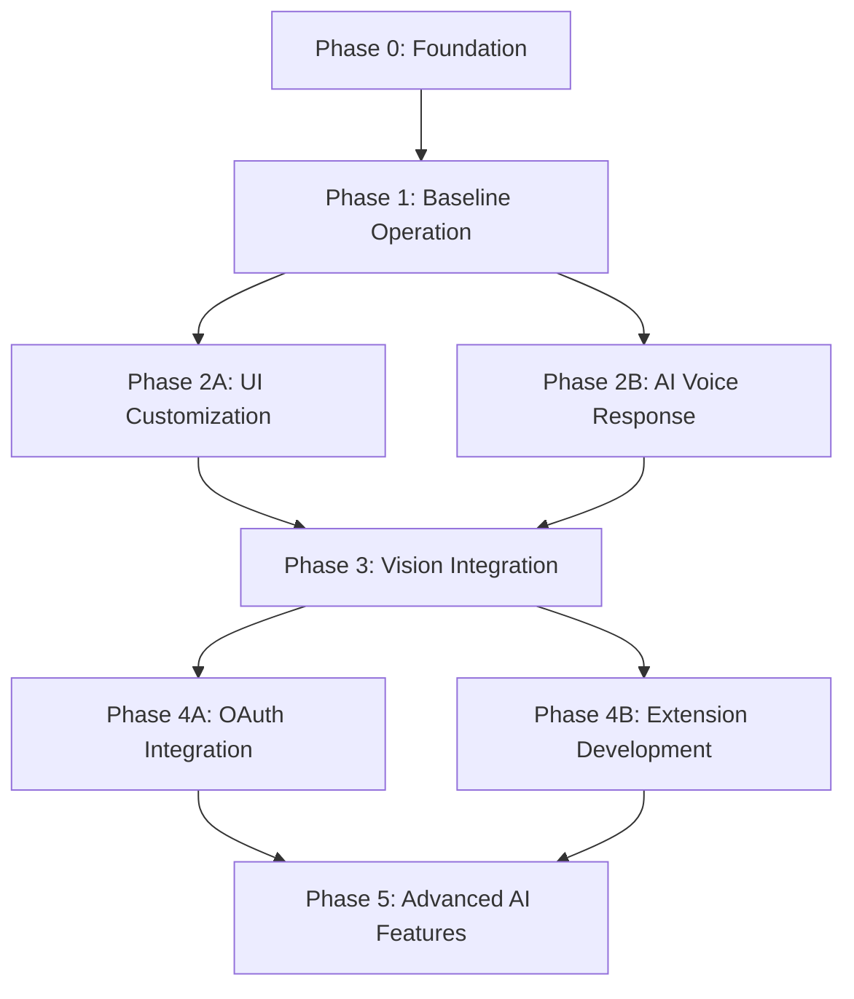

# Witchcraftery Implementation Guide

[](https://github.com/witchcraftery/omi/blob/main/witchcraftery_progress-report.md)

### 🔄 System Architecture

```markdown
**Project Resources:**
[Seeed Studio ESP32S3 Sense Microcontroller](_resources/seed-studio-esp32s3-sense)
[Omi Developer Documentation](https://docs.omi.me)
[iOS Flutter Development Documentation](https://docs.flutter.dev/platform-integration/ios)
```

**Current Status:**  
⏳ Phase 0 Planned | ⏳ Phase 1-6 Planned

## 📋 Implementation Process Overview

### Phase Dependencies & Critical Path



### Development Environment Setup

- ESP-IDF v4.4+ for ESP32-S3 firmware
- Flutter 3.10+ with iOS development capabilities
- Python 3.9+ for backend modifications
- Testing devices:
  - ESP32-S3-SENSE development board
  - iOS device (iPhone 11+)
  - Original Omi Dev2 pendant (for comparison testing)

### Repository Structure Overview

```
omi/
├── app/                 # Flutter iOS app
├── backend/             # Python transcription services
├── Friend/firmware/     # ESP32 firmware (base Omi)
├── witchcraftery_*.md   # Our implementation guides
└── _resources/          # ESP32-S3 documentation
```

## Phase 0: Base System Establishment

1. **Hardware Unboxing & Validation**
   - [ ] ESP32-S3-Sense Checklist:

     ```python
     # Quick hardware test script for MicroPython
     # Note: Need to flash MicroPython first if not already present
     from machine import Pin
     import time
     
     # Test onboard LED
     led = Pin(21, Pin.OUT)  # Check actual LED pin for Seeed Studio board
     
     # Blink test
     for _ in range(5):
         led.value(1)
         time.sleep(0.5)
         led.value(0)
         time.sleep(0.5)
     
     # Camera test will be added once we have the proper drivers
     ```

   - [ ] Installing ESP-IDF toolchain

     ```bash
     # For macOS
     mkdir -p ~/esp
     cd ~/esp
     git clone --recursive https://github.com/espressif/esp-idf.git
     cd esp-idf
     ./install.sh esp32s3
     . ./export.sh
     ```

   - [ ] Omi Dev2 Code Examination

     ```bash
     # Instead of flashing, first examine the existing codebase
     cd Friend/firmware
     ls -la firmware_v1.0/
     ```

2. **iOS App Fork Customization**

   ```swift
   // In app/ios/Runner/Info.plist
   <key>CFBundleIdentifier</key>
   <string>com.witchcraftery.omi</string>
   ```

   ```bash
   # Update bundle ID in Xcode project
   cd app/ios
   open Runner.xcworkspace
   # Then manually change Bundle Identifier in project settings
   ```

## Phase 1: Baseline Operation

### Hardware Adaptation

```cpp:firmware/main/config.h
// ESP32-S3-Sense specific pin mapping
#define MIC_PIN       12    // Original: 35
#define BUTTON_PIN    38    // Added for camera control
#define CAMERA_PWR    4     // New camera power control
```

### iOS App First-Run Customization

```swift:ios/Settings/FeatureFlags.swift
// Initial customization points
struct FeatureFlags {
  static let enableCameraSync = false  // Phase 3
  static let maxRecordingHours = 18.0  // Original: 12.0
}
```

**Phase 2: Personalization Layer

### Visual Identity Overrides

```swift:ios/Theme/ColorAssets.swift
// Branding quick wins
enum AppColors {
  static let primary = Color(hex: "#7D4CDB")  // Original: #2563EB
  static let recordingIndicator = Color.red  // Phase: Immediate
}
```

### Transcription Customization

```python:server/transcription/pipeline.py
# Adjust for personal speech patterns
CUSTOM_TERMS = {
  "witchcraftery": 0.9,  # Boost recognition of brand terms
  "athame": 0.7         # Custom vocabulary injection
}
```

**Phase 3: Vision Integration

### Camera Activation Sequence

```cpp:firmware/camera/camera_driver.c
// ESP32-S3-Sense specific init
void init_camera() {
  // Configure for 800x600 RGB565
  camera_config_t config;
  config.pin_pwdn = CAMERA_PWR;
  config.frame_size = FRAMESIZE_SVGA;
  // ... [full config]
}
```

### Image Processing Hook

```swift:ios/Services/ImageProcessor.swift
// New vision pipeline
func processCameraFrame(_ buffer: CVPixelBuffer) -> VisionAnalysis {
  // Phase: Add ML model integration here
}
```

**Phase 4: Extension Ecosystem**  

### New Extension Type Template

```swift:ios/Extensions/VisionExtension.swift
protocol VisionExtension: OmiExtension {
  var visualAnalysisThreshold: Float { get }
  func processVisualContext(_ frame: VisionAnalysis) 
}

// Example implementation stub
class ObjectTrackerExtension: VisionExtension {
  func triggerCondition(_ memory: OmiMemory) -> Bool {
    return memory.containsVisualObjects([.book, .coffeeCup])
  }
}
```

### 4.3: Notion Integration (continued)

Create file: `app/lib/services/notion_service.dart` (continuation):

```dart
          'Title': {
            'title': {},
          },
          'People': {
            'multi_select': {},
          },
          'Key Insights': {
            'rich_text': {},
          },
        },
      }),
    );
    
    if (response.statusCode == 200) {
      final json = jsonDecode(response.body);
      _dailySummaryDatabaseId = json['id'];
      notifyListeners();
      return true;
    }
    
    return false;
  }
  
  // Add a quick note to Notion
  Future<bool> addQuickNote({
    required String content,
    List<String> tags = const [],
  }) async {
    final token = await _oauthService.getFreshToken(OAuthProvider.notion);
    if (token == null) {
      return false;
    }
    
    // For quick notes, we'll use a separate database or page
    // This assumes you have a "Quick Notes" page in Notion
    // You would need to replace QUICK_NOTES_PAGE_ID with the actual ID
    
    final response = await http.post(
      Uri.parse('https://api.notion.com/v1/blocks/QUICK_NOTES_PAGE_ID/children'),
      headers: {
        'Authorization': 'Bearer $token',
        'Notion-Version': '2022-06-28',
        'Content-Type': 'application/json',
      },
      body: jsonEncode({
        'children': [
          {
            'object': 'block',
            'type': 'paragraph',
            'paragraph': {
              'rich_text': [
                {
                  'type': 'text',
                  'text': {
                    'content': content,
                  },
                  'annotations': {
                    'bold': true,
                  },
                },
              ],
            },
          },
          {
            'object': 'block',
            'type': 'paragraph',
            'paragraph': {
              'rich_text': [
                {
                  'type': 'text',
                  'text': {
                    'content': 'Tags: ${tags.join(", ")}',
                  },
                  'annotations': {
                    'italic': true,
                  },
                },
              ],
            },
          },
          {
            'object': 'block',
            'type': 'paragraph',
            'paragraph': {
              'rich_text': [
                {
                  'type': 'text',
                  'text': {
                    'content': 'Created: ${DateTime.now().toString()}',
                  },
                  'annotations': {
                    'italic': true,
                  },
                },
              ],
            },
          },
          {
            'object': 'block',
            'type': 'divider',
            'divider': {},
          },
        ],
      }),
    );
    
    return response.statusCode == 200;
  }
}

### 4.4: GitHub Integration

Create file: `app/lib/services/github_service.dart`:
```dart
import 'package:flutter/foundation.dart';
import 'package:http/http.dart' as http;
import 'dart:convert';
import 'oauth_service.dart';

class GitHubService with ChangeNotifier {
  // Singleton pattern
  static final GitHubService _instance = GitHubService._internal();
  factory GitHubService() => _instance;
  
  final OAuthService _oauthService = OAuthService();
  
  GitHubService._internal();
  
  // Check if authenticated
  bool get isAuthenticated => _oauthService.isAuthenticated(OAuthProvider.github);
  
  // Search repositories
  Future<List<Map<String, dynamic>>> searchRepositories(String query) async {
    final token = await _oauthService.getFreshToken(OAuthProvider.github);
    
    final headers = {
      'Accept': 'application/vnd.github.v3+json',
    };
    
    if (token != null) {
      headers['Authorization'] = 'token $token';
    }
    
    final response = await http.get(
      Uri.parse('https://api.github.com/search/repositories?q=${Uri.encodeComponent(query)}'),
      headers: headers,
    );
    
    if (response.statusCode == 200) {
      final json = jsonDecode(response.body);
      return (json['items'] as List<dynamic>)
        .map((item) => item as Map<String, dynamic>)
        .toList();
    }
    
    return [];
  }
  
  // Get repository details
  Future<Map<String, dynamic>?> getRepository(String owner, String repo) async {
    final token = await _oauthService.getFreshToken(OAuthProvider.github);
    
    final headers = {
      'Accept': 'application/vnd.github.v3+json',
    };
    
    if (token != null) {
      headers['Authorization'] = 'token $token';
    }
    
    final response = await http.get(
      Uri.parse('https://api.github.com/repos/$owner/$repo'),
      headers: headers,
    );
    
    if (response.statusCode == 200) {
      return jsonDecode(response.body);
    }
    
    return null;
  }
  
  // Get repository file content
  Future<String?> getFileContent(String owner, String repo, String path) async {
    final token = await _oauthService.getFreshToken(OAuthProvider.github);
    
    final headers = {
      'Accept': 'application/vnd.github.v3+json',
    };
    
    if (token != null) {
      headers['Authorization'] = 'token $token';
    }
    
    final response = await http.get(
      Uri.parse('https://api.github.com/repos/$owner/$repo/contents/$path'),
      headers: headers,
    );
    
    if (response.statusCode == 200) {
      final json = jsonDecode(response.body);
      
      // Content is Base64 encoded
      if (json['encoding'] == 'base64') {
        final bytes = base64Decode(json['content']);
        return utf8.decode(bytes);
      }
    }
    
    return null;
  }
  
  // Star a repository
  Future<bool> starRepository(String owner, String repo) async {
    final token = await _oauthService.getFreshToken(OAuthProvider.github);
    if (token == null) {
      return false;
    }
    
    final response = await http.put(
      Uri.parse('https://api.github.com/user/starred/$owner/$repo'),
      headers: {
        'Authorization': 'token $token',
        'Accept': 'application/vnd.github.v3+json',
        'Content-Length': '0',
      },
    );
    
    return response.statusCode == 204;
  }
  
  // Search code in GitHub
  Future<List<Map<String, dynamic>>> searchCode(String query) async {
    final token = await _oauthService.getFreshToken(OAuthProvider.github);
    
    final headers = {
      'Accept': 'application/vnd.github.v3+json',
    };
    
    if (token != null) {
      headers['Authorization'] = 'token $token';
    }
    
    final response = await http.get(
      Uri.parse('https://api.github.com/search/code?q=${Uri.encodeComponent(query)}'),
      headers: headers,
    );
    
    if (response.statusCode == 200) {
      final json = jsonDecode(response.body);
      return (json['items'] as List<dynamic>)
        .map((item) => item as Map<String, dynamic>)
        .toList();
    }
    
    return [];
  }
}
```

## Phase 5: Extension Framework
>
> Implement the extension system for adding new capabilities

### 5.1: Extension Base Framework

Create file: `app/lib/extensions/extension_base.dart`:

```dart
import 'package:flutter/foundation.dart';
import '../models/memory_models.dart';
import '../models/vision_analysis.dart';

/// Access level for extensions
enum MemoryAccessLevel {
  readOnly,
  readWrite,
  fullAccess
}

/// Base extension interface that all extensions must implement
abstract class OmiExtension {
  /// Unique identifier for the extension
  String get id;
  
  /// Display name of the extension
  String get name;
  
  /// Brief description of the extension
  String get description;
  
  /// Memory access level required
  MemoryAccessLevel get accessLevel;
  
  /// Icon for the extension
  String get iconPath;
  
  /// Check if extension should trigger for a given memory
  Future<bool> triggerCondition(Memory memory);
  
  /// Execute the extension logic
  Future<void> execute(ExtensionContext context);
  
  /// Optional cleanup when extension is disabled
  Future<void> cleanup() async {}
}

/// Context provided to extensions during execution
class ExtensionContext {
  final List<Memory> _recentMemories;
  final Memory _currentMemory;
  final Function(String) _logCallback;
  final Function(Memory) _saveMemoryCallback;
  final Function(String, dynamic) _storeDataCallback;
  final Function(String) _retrieveDataCallback;
  
  ExtensionContext({
    required List<Memory> recentMemories,
    required Memory currentMemory,
    required Function(String) logCallback,
    required Function(Memory) saveMemoryCallback,
    required Function(String, dynamic) storeDataCallback,
    required Function(String) retrieveDataCallback,
  }) : 
    _recentMemories = recentMemories,
    _currentMemory = currentMemory,
    _logCallback = logCallback,
    _saveMemoryCallback = saveMemoryCallback,
    _storeDataCallback = storeDataCallback,
    _retrieveDataCallback = retrieveDataCallback;
  
  /// Current memory being processed
  Memory get currentMemory => _currentMemory;
  
  /// Recent memories (limited by access level)
  List<Memory> get recentMemories => List.unmodifiable(_recentMemories);
  
  /// Log information from the extension
  void log(String message) => _logCallback(message);
  
  /// Save a modified memory
  Future<void> saveMemory(Memory memory) async => _saveMemoryCallback(memory);
  
  /// Store extension-specific data
  Future<void> storeData(String key, dynamic value) async => 
      _storeDataCallback(key, value);
  
  /// Retrieve extension-specific data
  Future<dynamic> retrieveData(String key) async => 
      _retrieveDataCallback(key);
  
  /// Generate a summary from a set of memories
  Future<MemorySummary> generateSummary({
    required List<Memory> memories,
    required String prompt,
  }) async {
    // Implementation would call the AI summarization service
    // For now, return a placeholder
    return MemorySummary(
      text: "Summary placeholder",
      insights: ["Insight 1", "Insight 2"],
      people: ["Person 1", "Person 2"],
    );
  }
  
  /// Fetch memories from today
  Future<List<Memory>> fetchTodaysMemories() async {
    // Implementation would query the memory repository
    // Return recent memories for now as placeholder
    return recentMemories;
  }
}

/// Extension manager handles registering, enabling, and executing extensions
class ExtensionManager with ChangeNotifier {
  // Singleton pattern
  static final ExtensionManager _instance = ExtensionManager._internal();
  factory ExtensionManager() => _instance;
  
  // Registered extensions
  final Map<String, OmiExtension> _extensions = {};
  
  // Enabled extensions
  final Set<String> _enabledExtensionIds = {};
  
  // Extension data storage
  final Map<String, Map<String, dynamic>> _extensionData = {};
  
  ExtensionManager._internal();
  
  // Get all registered extensions
  List<OmiExtension> get allExtensions => _extensions.values.toList();
  
  // Get enabled extensions
  List<OmiExtension> get enabledExtensions => 
      _enabledExtensionIds.map((id) => _extensions[id]!).toList();
  
  // Register an extension
  void registerExtension(OmiExtension extension) {
    _extensions[extension.id] = extension;
    notifyListeners();
  }
  
  // Enable an extension
  void enableExtension(String extensionId) {
    if (_extensions.containsKey(extensionId)) {
      _enabledExtensionIds.add(extensionId);
      notifyListeners();
    }
  }
  
  // Disable an extension
  Future<void> disableExtension(String extensionId) async {
    if (_enabledExtensionIds.contains(extensionId)) {
      // Run cleanup if needed
      await _extensions[extensionId]?.cleanup();
      
      _enabledExtensionIds.remove(extensionId);
      notifyListeners();
    }
  }
  
  // Check if extension is enabled
  bool isExtensionEnabled(String extensionId) => 
      _enabledExtensionIds.contains(extensionId);
  
  // Process a memory with all enabled extensions
  Future<void> processMemory(Memory memory) async {
    for (final id in _enabledExtensionIds) {
      final extension = _extensions[id];
      if (extension == null) continue;
      
      try {
        // Check if extension should trigger
        final shouldTrigger = await extension.triggerCondition(memory);
        if (!shouldTrigger) continue;
        
        // Create context for execution
        final context = ExtensionContext(
          recentMemories: [], // Would be populated from memory repository
          currentMemory: memory,
          logCallback: (message) => print("Extension ${extension.name}: $message"),
          saveMemoryCallback: (updatedMemory) {
            // Would save to memory repository
            print("Extension ${extension.name} updated memory");
          },
          storeDataCallback: (key, value) {
            // Store extension data
            _extensionData[extension.id] ??= {};
            _extensionData[extension.id]![key] = value;
          },
          retrieveDataCallback: (key) {
            // Retrieve extension data
            return _extensionData[extension.id]?[key];
          },
        );
        
        // Execute extension
        await extension.execute(context);
      } catch (e) {
        print("Error executing extension ${extension.name}: $e");
      }
    }
  }
}
```

### 5.2: Extension Type Interfaces

Create file: `app/lib/extensions/extension_types.dart`:

```dart
import 'package:flutter/foundation.dart';
import '../models/memory_models.dart';
import '../models/vision_analysis.dart';
import 'extension_base.dart';

/// Prompt-based extension that responds to user queries
abstract class PromptExtension extends OmiExtension {
  /// Prompt patterns that this extension can handle
  List<String> get promptPatterns;
  
  /// Check if this extension can handle a given prompt
  Future<bool> canHandlePrompt(String prompt);
  
  /// Handle a user prompt
  Future<String> handlePrompt(String prompt, ExtensionContext context);
  
  @override
  Future<bool> triggerCondition(Memory memory) async {
    // Prompt extensions are explicitly triggered by user queries
    // This would check if the memory contains a prompt that matches
    // one of the promptPatterns
    if (memory.type != MemoryType.prompt) return false;
    
    final prompt = memory.content;
    return await canHandlePrompt(prompt);
  }
}

/// Memory-based extension that runs in the background
abstract class MemoryExtension extends OmiExtension {
  @override
  Future<void> execute(ExtensionContext context) async {
    // Memory extensions process the context and may generate insights,
    // update memories, or perform other background tasks
  }
}

/// Integration extension that connects to external services
abstract class IntegrationExtension extends OmiExtension {
  /// Service that this extension integrates with
  String get serviceName;
  
  /// Check if integration is configured and authenticated
  Future<bool> isConfigured();
  
  /// Configure the integration
  Future<bool> configure();
  
  @override
  Future<void> execute(ExtensionContext context) async {
    // Integration extensions typically send data to or retrieve
    // data from external services
  }
}

/// Vision extension that processes camera images
abstract class VisionExtension extends OmiExtension {
  /// Threshold for visual analysis confidence
  double get visualAnalysisThreshold;
  
  /// Process a visual context
  Future<void> processVisualContext(VisionAnalysis analysis, ExtensionContext context);
  
  @override
  Future<void> execute(ExtensionContext context) async {
    // Get visual analysis from the memory
    final memory = context.currentMemory;
    
    // Check if memory has visual data
    if (memory.visualAnalysis == null) return;
    
    // Process the visual context
    await processVisualContext(memory.visualAnalysis!, context);
  }
}
```

Let me continue with example extensions and advanced AI features:

```markdown:witchcraftery_implementation-guide.md
### 5.3: Example Extensions

Create file: `app/lib/extensions/notion_daily_summary_extension.dart`:
```dart
import 'package:flutter/foundation.dart';
import '../models/memory_models.dart';
import '../services/notion_service.dart';
import 'extension_base.dart';
import 'extension_types.dart';

class NotionDailySummaryExtension extends MemoryExtension {
  final NotionService _notionService = NotionService();
  
  @override
  String get id => 'notion_daily_summary';
  
  @override
  String get name => 'Notion Daily Summary';
  
  @override
  String get description => 
      'Creates a daily summary of your memories in Notion';
  
  @override
  MemoryAccessLevel get accessLevel => MemoryAccessLevel.readOnly;
  
  @override
  String get iconPath => 'assets/icons/notion_icon.png';
  
  @override
  Future<bool> triggerCondition(Memory memory) async {
    // Check if Notion is authenticated
    if (!_notionService.isAuthenticated) return false;
    
    // Check if database ID is set
    if (_notionService.dailySummaryDatabaseId == null) return false;
    
    // Check time - trigger at end of day (10 PM)
    final now = DateTime.now();
    if (now.hour == 22 && now.minute < 5) {
      // Check if we already created a summary today
      final lastRun = await _getLastRunDate();
      final today = DateTime(now.year, now.month, now.day);
      
      return lastRun == null || lastRun.isBefore(today);
    }
    
    return false;
  }
  
  @override
  Future<void> execute(ExtensionContext context) async {
    // Get today's memories
    final memories = await context.fetchTodaysMemories();
    if (memories.isEmpty) {
      context.log('No memories to summarize today');
      return;
    }
    
    // Generate summary
    final summary = await context.generateSummary(
      memories: memories,
      prompt: 'Summarize today\'s key events and insights',
    );
    
    // Create in Notion
    final success = await _notionService.createDailySummary(
      date: DateTime.now().toIso8601String(),
      summary: summary.text,
      keyInsights: summary.insights,
      people: summary.people,
    );
    
    if (success) {
      context.log('Created daily summary in Notion');
      // Save last run date
      await _setLastRunDate(DateTime.now());
    } else {
      context.log('Failed to create daily summary in Notion');
    }
  }
  
  // Get last run date from extension storage
  Future<DateTime?> _getLastRunDate() async {
    final data = await retrieveData('last_run_date');
    if (data == null) return null;
    
    return DateTime.parse(data as String);
  }
  
  // Set last run date in extension storage
  Future<void> _setLastRunDate(DateTime date) async {
    await storeData('last_run_date', date.toIso8601String());
  }
}
```

Create file: `app/lib/extensions/object_tracker_extension.dart`:

```dart
import 'package:flutter/foundation.dart';
import '../models/memory_models.dart';
import '../models/vision_analysis.dart';
import 'extension_base.dart';
import 'extension_types.dart';

class ObjectTrackerExtension extends VisionExtension {
  @override
  String get id => 'object_tracker';
  
  @override
  String get name => 'Object Tracker';
  
  @override
  String get description => 
      'Tracks objects seen throughout the day';
  
  @override
  MemoryAccessLevel get accessLevel => MemoryAccessLevel.readOnly;
  
  @override
  String get iconPath => 'assets/icons/object_icon.png';
  
  @override
  double get visualAnalysisThreshold => 0.7;
  
  @override
  Future<bool> triggerCondition(Memory memory) async {
    // Only trigger for memories with visual analysis
    if (memory.visualAnalysis == null) return false;
    
    // Check if any interesting objects are detected
    return memory.visualAnalysis!.containsObjects([
      'book', 'coffee', 'laptop', 'phone', 'person',
      'car', 'bicycle', 'plant', 'food', 'drink'
    ]);
  }
  
  @override
  Future<void> processVisualContext(
    VisionAnalysis analysis, 
    ExtensionContext context
  ) async {
    // Get object counts from storage
    final objectCounts = await _getObjectCounts();
    
    // Update counts for detected objects
    for (final obj in analysis.detectedObjects) {
      if (obj.confidence >= visualAnalysisThreshold) {
        final label = obj.label.toLowerCase();
        objectCounts[label] = (objectCounts[label] ?? 0) + 1;
      }
    }
    
    // Store updated counts
    await _saveObjectCounts(objectCounts);
    
    // Log objects seen
    final objectsSeen = analysis.detectedObjects
      .where((obj) => obj.confidence >= visualAnalysisThreshold)
      .map((obj) => obj.label)
      .join(', ');
    
    context.log('Tracked objects: $objectsSeen');
  }
  
  // Get object counts from extension storage
  Future<Map<String, int>> _getObjectCounts() async {
    final data = await retrieveData('object_counts');
    if (data == null) return {};
    
    return Map<String, int>.from(data as Map);
  }
  
  // Save object counts to extension storage
  Future<void> _saveObjectCounts(Map<String, int> counts) async {
    await storeData('object_counts', counts);
  }
}
```

## Phase 6: Advanced AI Features
>
> Implement the cutting-edge intelligence features

### 6.1: Spatial Memory Anchoring

Create file: `app/lib/services/spatial_anchoring_service.dart`:

```dart
import 'package:flutter/foundation.dart';
import 'dart:typed_data';
import '../models/memory_models.dart';
import '../models/vision_analysis.dart';
import 'storage_service.dart';

class SpatialAnchoringService with ChangeNotifier {
  // Singleton pattern
  static final SpatialAnchoringService _instance = SpatialAnchoringService._internal();
  factory SpatialAnchoringService() => _instance;
  
  final StorageService _storage = StorageService();
  
  // Spatial anchors
  Map<String, SpatialAnchor> _anchors = {};
  String? _currentAnchorId;
  
  SpatialAnchoringService._internal() {
    _loadAnchors();
  }
  
  // Current anchor
  SpatialAnchor? get currentAnchor => 
      _currentAnchorId != null ? _anchors[_currentAnchorId] : null;
  
  // All anchors
  List<SpatialAnchor> get allAnchors => _anchors.values.toList();
  
  // Load anchors from storage
  Future<void> _loadAnchors() async {
    final data = await _storage.loadData('spatial_anchors');
    if (data != null) {
      _anchors = Map.fromEntries(
        (data as Map).entries.map((entry) => 
          MapEntry(entry.key as String, 
            SpatialAnchor.fromJson(entry.value as Map<String, dynamic>))
        )
      );
      notifyListeners();
    }
  }
  
  // Save anchors to storage
  Future<void> _saveAnchors() async {
    final data = Map.fromEntries(
      _anchors.entries.map((entry) => 
        MapEntry(entry.key, entry.value.toJson())
      )
    );
    
    await _storage.saveData('spatial_anchors', data);
  }
  
  // Create a new anchor
  Future<String> createAnchor({
    required String name,
    required VisionAnalysis analysis,
    required List<Memory> associatedMemories,
  }) async {
    final id = 'anchor_${DateTime.now().millisecondsSinceEpoch}';
    
    _anchors[id] = SpatialAnchor(
      id: id,
      name: name,
      visualHash: analysis.visualHash,
      colorSignature: analysis.dominantColors,
      createdAt: DateTime.now(),
      lastVisited: DateTime.now(),
      visitCount: 1,
      associatedMemoryIds: associatedMemories.map((m) => m.id).toList(),
    );
    
    _currentAnchorId = id;
    notifyListeners();
    await _saveAnchors();
    
    return id;
  }
  
  // Identify current anchor from visual context
  Future<SpatialAnchor?> identifyAnchor(VisionAnalysis analysis) async {
    if (_anchors.isEmpty) return null;
    
    String? bestMatchId;
    double bestMatchScore = 0.0;
    
    // Compare visual hash with all anchors
    for (final entry in _anchors.entries) {
      final anchor = entry.value;
      final score = _calculateVisualSimilarity(analysis, anchor);
      
      if (score > bestMatchScore && score > 0.85) { // 85% threshold
        bestMatchScore = score;
        bestMatchId = entry.key;
      }
    }
    
    if (bestMatchId != null) {
      // Update anchor
      final anchor = _anchors[bestMatchId]!;
      _anchors[bestMatchId] = anchor.copyWith(
        lastVisited: DateTime.now(),
        visitCount: anchor.visitCount + 1,
      );
      
      _currentAnchorId = bestMatchId;
      notifyListeners();
      await _saveAnchors();
      
      return _anchors[bestMatchId];
    }
    
    return null;
  }
  
  // Calculate similarity between visual analysis and anchor
  double _calculateVisualSimilarity(VisionAnalysis analysis, SpatialAnchor anchor) {
    // Compare perceptual hashes (80% of score)
    final hashSimilarity = _calculateHashSimilarity(
      analysis.visualHash, 
      anchor.visualHash
    );
    
    // Compare color signatures (20% of score)
    double colorSimilarity = 0.0;
    if (analysis.dominantColors.isNotEmpty && anchor.colorSignature.isNotEmpty) {
      // Simple color comparison - in a real implementation this would be more sophisticated
      colorSimilarity = analysis.dominantColors[0].color == anchor.colorSignature[0].color ? 1.0 : 0.0;
    }
    
    // Combined score
    return (hashSimilarity * 0.8) + (colorSimilarity * 0.2);
  }
  
  // Calculate similarity between two perceptual hashes (0.0 to 1.0)
  double _calculateHashSimilarity(Uint8List hash1, Uint8List hash2) {
    if (hash1.length != hash2.length) return 0.0;
    
    int hammingDistance = 0;
    int totalBits = hash1.length * 8;
    
    for (int i = 0; i < hash1.length; i++) {
      int xor = hash1[i] ^ hash2[i];
      
      // Count bits set to 1 (differences)
      while (xor != 0) {
        hammingDistance += xor & 1;
        xor >>= 1;
      }
    }
    
    // Convert to similarity (0.0 to 1.0)
    return 1.0 - (hammingDistance / totalBits);
  }
  
  // Get memories associated with current anchor
  Future<List<Memory>> getAssociatedMemories() async {
    if (_currentAnchorId == null) return [];
    
    final anchor = _anchors[_currentAnchorId]!;
    
    // In a real implementation, this would fetch memories from a repository
    // Return empty list for now
    return [];
  }
  
  // Add memory to current anchor
  Future<bool> addMemoryToCurrentAnchor(Memory memory) async {
    if (_currentAnchorId == null) return false;
    
    final anchor = _anchors[_currentAnchorId]!;
    
    if (!anchor.associatedMemoryIds.contains(memory.id)) {
      _anchors[_currentAnchorId] = anchor.copyWith(
        associatedMemoryIds: [...anchor.associatedMemoryIds, memory.id],
      );
      
      notifyListeners();
      await _saveAnchors();
    }
    
    return true;
  }
  
  // Delete anchor
  Future<bool> deleteAnchor(String anchorId) async {
    if (!_anchors.containsKey(anchorId)) return false;
    
    _anchors.remove(anchorId);
    
    if (_currentAnchorId == anchorId) {
      _currentAnchorId = null;
    }
    
    notifyListeners();
    await _saveAnchors();
    
    return true;
  }
}

class SpatialAnchor {
  final String id;
  final String name;
  final Uint8List visualHash;
  final List<ColorInfo> colorSignature;
  final DateTime createdAt;
  final DateTime lastVisited;
  final int visitCount;
  final List<String> associatedMemoryIds;
  
  SpatialAnchor({
    required this.id,
    required this.name,
    required this.visualHash,
    required this.colorSignature,
    required this.createdAt,
    required this.lastVisited,
    required this.visitCount,
    required this.associatedMemoryIds,
  });
  
  SpatialAnchor copyWith({
    String? name,
    Uint8List? visualHash,
    List<ColorInfo>? colorSignature,
    DateTime? lastVisited,
    int? visitCount,
    List<String>? associatedMemoryIds,
  }) {
    return SpatialAnchor(
      id: this.id,
      name: name ?? this.name,
      visualHash: visualHash ?? this.visualHash,
      colorSignature: colorSignature ?? this.colorSignature,
      createdAt: this.createdAt,
      lastVisited: lastVisited ?? this.lastVisited,
      visitCount: visitCount ?? this.visitCount,
      associatedMemoryIds: associatedMemoryIds ?? this.associatedMemoryIds,
    );
  }
  
  Map<String, dynamic> toJson() {
    return {
      'id': id,
      'name': name,
      'visualHash': visualHash.toList(),
      'colorSignature': colorSignature.map((c) => c.toJson()).toList(),
      'createdAt': createdAt.toIso8601String(),
      'lastVisited': lastVisited.toIso8601String(),
      'visitCount': visitCount,
      'associatedMemoryIds': associatedMemoryIds,
    };
  }
  
  factory SpatialAnchor.fromJson(Map<String, dynamic> json) {
    return SpatialAnchor(
      id: json['id'] as String,
      name: json['name'] as String,
      visualHash: Uint8List.fromList(
        (json['visualHash'] as List).cast<int>(),
      ),
      colorSignature: (json['colorSignature'] as List)
        .map((c) => ColorInfo.fromJson(c as Map<String, dynamic>))
        .toList(),
      createdAt: DateTime.parse(json['createdAt'] as String),
      lastVisited: DateTime.parse(json['lastVisited'] as String),
      visitCount: json['visitCount'] as int,
      associatedMemoryIds: (json['associatedMemoryIds'] as List).cast<String>(),
    );
  }
}
```

### 6.2: Continuous Context Threading

Create file: `app/lib/services/context_threading_service.dart`:

```dart
import 'package:flutter/foundation.dart';
import '../models/memory_models.dart';
import 'storage_service.dart';

class ContextThreadingService with ChangeNotifier {
  // Singleton pattern
  static final ContextThreadingService _instance = ContextThreadingService._internal();
  factory ContextThreadingService() => _instance;
  
  final StorageService _storage = StorageService();
  
  // Memory threads
  Map<String, MemoryThread> _threads = {};
  
  ContextThreadingService._internal() {
    _loadThreads();
  }
  
  // All threads
  List<MemoryThread> get allThreads => _threads.values.toList();
  
  // Load threads from storage
  Future<void> _loadThreads() async {
    final data = await _storage.loadData('memory_threads');
    if (data != null) {
      _threads = Map.fromEntries(
        (data as Map).entries.map((entry) => 
          MapEntry(entry.key as String, 
            MemoryThread.fromJson(entry.value as Map<String, dynamic>))
        )
      );
      notifyListeners();
    }
  }
  
  // Save threads to storage
  Future<void> _saveThreads() async {
    final data = Map.fromEntries(
      _threads.entries.map((entry) => 
        MapEntry(entry.key, entry.value.toJson())
      )
    );
    
    await _storage.saveData('memory_threads', data);
  }
  
  // Find threads for a set of memories
  Future<List<MemoryThread>> findThreadsForMemories(List<Memory> memories) async {
    final result = <MemoryThread>[];
    
    for (final thread in _threads.values) {
      for (final memoryId in thread.memoryIds) {
        if (memories.any((m) => m.id == memoryId)) {
          result.add(thread);
          break;
        }
      }
    }
    
    return result;
  }
  
  // Find or create thread for a topic
  Future<MemoryThread> findOrCreateThreadForTopic(String topic) async {
    // Look for existing thread
    for (final thread in _threads.values) {
      if (thread.theme.toLowerCase() == topic.toLowerCase()) {
        return thread;
      }
    }
    
    // Create new thread
    final id = 'thread_${DateTime.now().millisecondsSinceEpoch}';
    final thread = MemoryThread(
      id: id,
      theme: topic,
      memoryIds: [],
      createdAt: DateTime.now(),
      lastUpdated: DateTime.now(),
      coherence: 1.0,
    );
    
    _threads[id] = thread;
    notifyListeners();
    await _saveThreads();
    
    return thread;
  }
  
  // Add memory to thread
  Future<void> addMemoryToThread(String threadId, String memoryId) async {
    if (!_threads.containsKey(threadId)) return;
    
    final thread = _threads[threadId]!;
    if (thread.memoryIds.contains(memoryId)) return;
    
    _threads[threadId] = thread.copyWith(
      memoryIds: [...thread.memoryIds, memoryId],
      lastUpdated: DateTime.now(),
    );
    
    notifyListeners();
    await _saveThreads();
  }
  
  // Identify threads for new memories
  Future<void> identifyThreadsForMemories(List<Memory> newMemories) async {
    // This would normally use the AI service to identify themes
    // For now, use a simple keyword-based approach
    
    // Keywords to look for (simplified example)
    final topicKeywords = {
      'work': ['job', 'meeting', 'project', 'boss', 'colleague', 'deadline'],
      'health': ['exercise', 'workout', 'run', 'gym', 'diet', 'nutrition'],
      'home': ['house', 'apartment', 'cleaning', 'cooking', 'shopping'],
      'social': ['friend', 'party', 'dinner', 'coffee', 'chat', 'meet'],
    };
    
    for (final memory in newMemories) {
      final content = memory.content.toLowerCase();
      
      for (final topic in topicKeywords.entries) {
        if (topic.value.any((keyword) => content.contains(keyword))) {
          // Find or create thread for this topic
          final thread = await findOrCreateThreadForTopic(topic.key);
          
          // Add memory to thread
          await addMemoryToThread(thread.id, memory.id);
          
          // Only add to one thread for now
          break;
        }
      }
    }
  }
}

class MemoryThread {
  final String id;
  final String theme;
  final List<String> memoryIds;
  final DateTime createdAt;
  final DateTime lastUpdated;
  final double coherence;
  
  MemoryThread({
    required this.id,
    required this.theme,
    required this.memoryIds,
    required this.createdAt,
    required this.lastUpdated,
    required this.coherence,
  });
  
  MemoryThread copyWith({
    String? theme,
    List<String>? memoryIds,
    DateTime? lastUpdated,
    double? coherence,
  }) {
    return MemoryThread(
      id: this.id,
      theme: theme ?? this.theme,
      memoryIds: memoryIds ?? this.memoryIds,
      createdAt: this.createdAt,
      lastUpdated: lastUpdated ?? this.lastUpdated,
      coherence: coherence ?? this.coherence,
    );
  }
  
  Map<String, dynamic> toJson() {
    return {
      'id': id,
      'theme': theme,
      'memoryIds': memoryIds,
      'createdAt': createdAt.toIso8601String(),
      'lastUpdated': lastUpdated.toIso8601String(),
      'coherence': coherence,
    };
  }
  
  factory MemoryThread.fromJson(Map<String, dynamic> json) {
    return MemoryThread(
      id: json['id'] as String,
      theme: json['theme'] as String,
      memoryIds: (json['memoryIds'] as List).cast<String>(),
      createdAt: DateTime.parse(json['createdAt'] as String),
      lastUpdated: DateTime.parse(json['lastUpdated'] as String),
      coherence: json['coherence'] as double,
    );
  }
}
```
